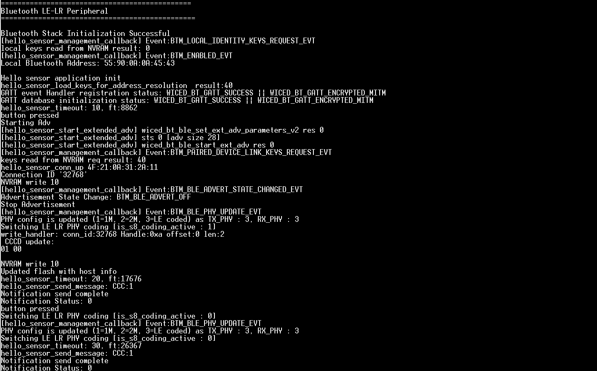
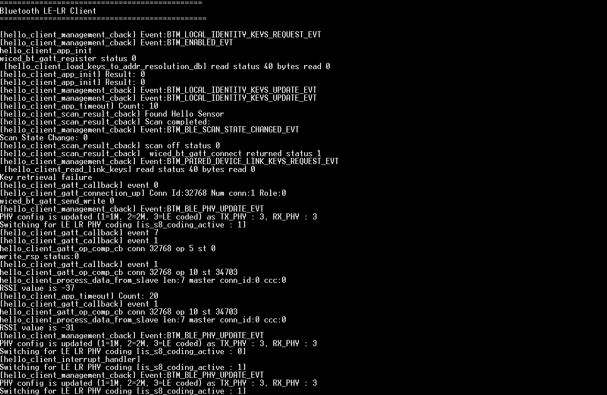

# AIROC&trade;: Bluetooth&reg; LE Long Range Peripheral

The following two examples, when executed together, demonstrate the use of LE Long Range PHY with Infineon AIROC&trade; CYW55xxx Bluetooth&reg; devices.

1. **LE Long Range Peripheral application (GATT Server):** This application documented and demonstrated here is an implementation of Bluetooth&reg; LE custom service with security. During initialization, the app registers with the LE stack to receive notifications, including bonding complete, connection status change, and peer write. When a device is successfully bonded, the application saves the peer's Bluetooth&reg; device address to its NVRAM. Bonded devices can also write into the client configuration descriptor of the notification characteristic. That is also saved in the device's NVRAM.  When the user pushes the button, a notification/indication is sent to the bonded and registered host.

2. **LE Long Range Central application (GATT Client):** This complementary application implements the peer role as the central GATT client. Use ModusToolbox&trade; software to create the project, or view the application README and download manually from: https://github.com/Infineon/mtb-example-btstack-threadx-le-lr-central

Bluetooth&reg; LE Long Range (LR) feature is designed to provide extended range and improved robustness for LE devices. LR achieves this by using a new modulation scheme called Coded PHY, which uses Forward Error Correction (FEC) to improve the signal-to-noise ratio and increase the range of LE devices.

The Coded PHY scheme has two different coding schemes: **S2** and **S8**.
- **S2** provides a higher data rate than **S8**, and designed for applications that require a moderate range and data rate.
- **S8** provides the longest range and highest robustness, but has a lower data rate than **S2**. It is designed for applications that require the longest possible range and the highest robustness, even at the cost of a lower data rate.

**Note:** Both code examples are set to **S8** by default in order to showcase the longest range achievable with the Long Range feature. By setting the value of **USE_S8_DEFAULT** to **0** in the Makefile, the default coding scheme will be switched from **S8** to **S2**.

This README covers the GATT Server application in detail.


[View this README on GitHub.](https://github.com/Infineon/mtb-example-btstack-threadx-le-lr-peripheral)

[Provide feedback on this code example.](https://cypress.co1.qualtrics.com/jfe/form/SV_1NTns53sK2yiljn?Q_EED=eyJVbmlxdWUgRG9jIElkIjoiQ0UyNDA3MzYiLCJTcGVjIE51bWJlciI6IjAwMi00MDczNiIsIkRvYyBUaXRsZSI6IkFJUk9DJnRyYWRlOzogQmx1ZXRvb3RoJnJlZzsgTEUgTG9uZyBSYW5nZSBQZXJpcGhlcmFsIiwicmlkIjoiY2hhdWhhbiBoYXJkaWsiLCJEb2MgdmVyc2lvbiI6IjEuMC4wIiwiRG9jIExhbmd1YWdlIjoiRW5nbGlzaCIsIkRvYyBEaXZpc2lvbiI6Ik1DRCIsIkRvYyBCVSI6IklDVyIsIkRvYyBGYW1pbHkiOiJXSUZJIn0=)


## Requirements

- [ModusToolbox&trade; software](https://www.infineon.com/modustoolbox) v3.0 or later (tested with v3.0)
- Board support package (BSP) minimum required version for:v1.0.0
- Programming language: C
- Associated parts: [CYW955513EVK-01] (version 1.0.1) and [CYW955913EVK-01] (version 1.0.0)

## Supported toolchains (make variable 'TOOLCHAIN')

- GNU Arm&reg; embedded compiler v10.3.1 (`GCC_ARM`) - Default value of `TOOLCHAIN`

## Supported kits

-[CYW955513EVK-01 Wi-Fi Bluetooth® Prototyping Kit] (`CYW955513EVK-01`) 
-[CYW955913EVK-01 Wi-Fi Bluetooth® Prototyping Kit] (`CYW955913EVK-01`)

## Hardware setup

This example uses the kit’s default configuration. See the respective kit guide to ensure that the kit is configured correctly.

## Software setup

Install a terminal emulator if you don't have one. Instructions in this document use [Tera Term](https://ttssh2.osdn.jp/index.html.en).

## Using the code example

Create the project and open it using one of the following:

<details><summary><b>In Eclipse IDE for ModusToolbox&trade; software</b></summary>

1. Click the **New Application** link in the **Quick Panel** (or, use **File** > **New** > **ModusToolbox&trade; Application**). This launches the [Project Creator](https://www.infineon.com/ModusToolboxProjectCreator) tool.

2. Pick a kit supported by the code example from the list shown in the **Project Creator - Choose Board Support Package (BSP)** dialog.

    When you select a supported kit, the example is reconfigured automatically to work with the kit. To work with a different supported kit later, use the [Library Manager](https://www.infineon.com/ModusToolboxLibraryManager) to choose the BSP for the supported kit. You can use the Library Manager to select or update the BSP and firmware libraries used in this application. To access the Library Manager, click the link from the **Quick Panel**.

   You can also just start the application creation process again and select a different kit.

   If you want to use the application for a kit not listed here, you may need to update the source files. If the kit does not have the required resources, the application may not work.

3. In the **Project Creator - Select Application** dialog, choose the **Bluetooth LE Long Range Peripheral** example by enabling the checkbox.

4. (Optional) Change the suggested **New Application Name**.

5. The **Application(s) Root Path** defaults to the Eclipse workspace which is usually the desired location for the application. If you want to store the application in a different location, you can change the *Application(s) Root Path* value. Applications that share libraries should be in the same root path.

6. Click **Create** to complete the application creation process.

For more details, see the [Eclipse IDE for ModusToolbox&trade; software user guide](https://www.infineon.com/MTBEclipseIDEUserGuide) (locally available at *{ModusToolbox&trade; software install directory}/ide_{version}/docs/mtb_ide_user_guide.pdf*).

</details>

<details><summary><b>In command-line interface (CLI)</b></summary>

ModusToolbox&trade; software provides the Project Creator as both a GUI tool and the command line tool, "project-creator-cli". The CLI tool can be used to create applications from a CLI terminal or from within batch files or shell scripts. This tool is available in the *{ModusToolbox&trade; software install directory}/tools_{version}/project-creator/* directory.

Use a CLI terminal to invoke the "project-creator-cli" tool. On Windows, use the command line "modus-shell" program provided in the ModusToolbox&trade; software installation instead of a standard Windows command-line application. This shell provides access to all ModusToolbox&trade; software tools. You can access it by typing `modus-shell` in the search box in the Windows menu. In Linux and macOS, you can use any terminal application.

The "project-creator-cli" tool has the following arguments:

Argument | Description | Required/optional
---------|-------------|-----------
`--board-id` | Defined in the `<id>` field of the [BSP](https://github.com/Infineon?q=bsp-manifest&type=&language=&sort=) manifest | Required
`--app-id`   | Defined in the `<id>` field of the [CE](https://github.com/Infineon?q=ce-manifest&type=&language=&sort=) manifest | Required
`--target-dir`| Specify the directory in which the application is to be created if you prefer not to use the default current working directory | Optional
`--user-app-name`| Specify the name of the application if you prefer to have a name other than the example's default name | Optional

<br>

The following example clones the "[mtb-example-btstack-threadx-le-lr-peripheral](https://github.com/Infineon/mtb-example-btstack-threadx-le-lr-peripheral)" application with the desired name "LeLrPeripheral" configured for the *CYW955913EVK-01* BSP into the specified working directory, *C:/mtb_projects*:

   ```
   project-creator-cli --board-id CYW955913EVK-01 --app-id mtb-example-btstack-threadx-le-lr-peripheral --user-app-name LeLrPeripheral --target-dir "C:/mtb_projects"
   ```

**Note:** The project-creator-cli tool uses the `git clone` and `make getlibs` commands to fetch the repository and import the required libraries. For details, see the "Project creator tools" section of the [ModusToolbox&trade; software user guide](https://www.infineon.com/ModusToolboxUserGuide) (locally available at *{ModusToolbox&trade; software install directory}/docs_{version}/mtb_user_guide.pdf*).

To work with a different supported kit later, use the [Library Manager](https://www.infineon.com/ModusToolboxLibraryManager) to choose the BSP for the supported kit. You can invoke the Library Manager GUI tool from the terminal using `make library-manager` command or use the Library Manager CLI tool "library-manager-cli" to change the BSP.

The "library-manager-cli" tool has the following arguments:

Argument | Description | Required/optional
---------|-------------|-----------
`--add-bsp-name` | Name of the BSP that should be added to the application | Required
`--set-active-bsp` | Name of the BSP that should be as active BSP for the application | Required
`--add-bsp-version`| Specify the version of the BSP that should be added to the application if you do not wish to use the latest from manifest | Optional
`--add-bsp-location`| Specify the location of the BSP (local/shared) if you prefer to add the BSP in a shared path | Optional

<br />

Following example adds the CYW955913EVK-01 BSP to the already created application and makes it the active BSP for the app:

   ```
   library-manager-cli --project "C:/mtb_projects/LeLrPeripheral" --add-bsp-name CYW955913EVK-01 --add-bsp-version "latest-v1.X" --add-bsp-location "local"

   library-manager-cli --project "C:/mtb_projects/LeLrPeripheral" --set-active-bsp APP_CYW955913EVK-01
   ```

</details>

<details><summary><b>In third-party IDEs</b></summary>

Use one of the following options:

- **Use the standalone [Project Creator](https://www.infineon.com/ModusToolboxProjectCreator) tool:**

   1. Launch Project Creator from the Windows Start menu or from *{ModusToolbox&trade; software install directory}/tools_{version}/project-creator/project-creator.exe*.

   2. In the initial **Choose Board Support Package** screen, select the BSP, and click **Next**.

   3. In the **Select Application** screen, select the appropriate IDE from the **Target IDE** drop-down menu.

   4. Click **Create** and follow the instructions printed in the bottom pane to import or open the exported project in the respective IDE.

<br>

- **Use command-line interface (CLI):**

   1. Follow the instructions from the **In command-line interface (CLI)** section to create the application.

   2. Export the application to a supported IDE using the `make <ide>` command.

   3. Follow the instructions displayed in the terminal to create or import the application as an IDE project.

For a list of supported IDEs and more details, see the "Exporting to IDEs" section of the [ModusToolbox&trade; software user guide](https://www.infineon.com/ModusToolboxUserGuide) (locally available at *{ModusToolbox&trade; software install directory}/docs_{version}/mtb_user_guide.pdf*).

</details>

## Operation

1. Connect the two boards to your PC using the provided USB cable through the USB connector.

2. Open a terminal program and select the KitProg3 COM port. Set the serial port parameters to 8N1 and 115200 baud. You need two windows of the terminal application to view messages from both the peripheral and the central applications.

3. Program one board with the central application and the other with the peripheral application.

   <details><summary><b>Using Eclipse IDE for ModusToolbox&trade; software</b></summary>

      1. Select the application project in the Project Explorer.

      2. In the **Quick Panel**, scroll down, and click **\<Application Name> Program (KitProg3_MiniProg4)**.
   </details>

   <details><summary><b>Using CLI</b></summary>

      From the terminal, execute the `make program` command to build and program the application using the default toolchain to the default target. The default toolchain is specified in the application's Makefile but you can override this value manually:
      ```
      make program TOOLCHAIN=<toolchain>
      ```

      Example:
      ```
      make program TOOLCHAIN=GCC_ARM
      ```

    </details>

After programming, the application starts automatically.

4. Push the user button on the peripheral to start advertising.

5. Push the user button on the central board to start the connection process.

6. After establishing a connection, the peripheral application will initiate the transmission of notifications to the client.

7. To switch between S2 and S8 coding schemes, press the user button on the peripheral board.

**Note:** Changing the S2/S8 coding scheme on the peripheral board does not automatically change the coding scheme on the central board. Therefore, to ensure that both boards are using the same coding scheme, the user must press the user button on the central board to match the coding scheme for both boards.

  **Figure 1. Terminal output on peripheral side**

   

  **Figure 2. Terminal output on central side**

   

## Programming a CYW55xxx board (when multiple boards are connected)

### From the CLI

1. Connect the device and find the enumerated UART port. 
2. You can program the board using the `make program UART=COMxx` command (Replace xx with the enumerated UART port) from the ModusToolbox&trade; terminal.

### From the IDE (via launch configurations available in Quick Panel)

1. Connect the device and find the enumerated UART port. 
2. Go to your application and open the Makefile. Add below line in the Makefile (Replace xx with the enumerated UART port)
```
   UART = COMxx
```
3. Select the application project in the Project Explorer.
4. In the **Quick Panel**, scroll down, and click **\<Application Name> Program (KitProg3_MiniProg4)**.

## Debugging


You can debug the example to step through the code.


<details><summary><b>In Eclipse IDE</b></summary>

Use the **\<Application Name> Attach (KitProg3_MiniProg4)** configuration in the **Quick Panel**. For details, see the "Program and debug" section in the [Eclipse IDE for ModusToolbox&trade; user guide](https://www.infineon.com/MTBEclipseIDEUserGuide).


</details>


<details><summary><b>In other IDEs</b></summary>

Follow the instructions in your preferred IDE.
</details>

## Design and implementation

### LE-LR

LE-LR represents LE Long Range PHY. The two mentioned CEs demonstrate the use of LE-LR PHY to advertise, scan for advertisements, and connect.

The mandatory symbol rate is 1 mega symbol per second (Msym/s), where 1 symbol represents 1-bit, therefore, supporting a bit rate of 1 megabit per second (Mb/s), which is referred to as the LE 1M PHY.

The 1 Msym/s symbol rate may optionally support error correction coding, which is referred to as the LE Coded PHY. This may use either of two coding schemes: S=2, where 2 symbols represent 1-bit, therefore, supporting a bit rate of 500 kb/s, and S=8, where 8 symbols represent 1-bit, therefore, supporting a bit rate of 125 kb/s.

### Program

The LE Long Range Peripheral code example configures the device as Bluetooth&reg; LE GAP Peripheral/GATT Server, and the LE Long Range Central application configures the device as Bluetooth&reg; LE GAP Central/GATT Client.

The peripheral example implements a custom GATT profile that includes the following three services:

- Hello Sensor custom service
- Device Information service
- Battery Level service

The Hello Sensor service includes a custom characteristic - *Notify*. The Notify characteristic is used to send a notification or indication to the peer client device upon connection.

The application uses a UART resource from the hardware abstraction layer (HAL) to send debug messages on a UART terminal emulator. The UART resource initialization and retargeting of standard I/O to the UART port are done using the retarget-io library.

Upon reset, the applications start automatically and initialize the Bluetooth&reg; stack and other device peripherals. The peripheral device starts to advertise its presence to the peer central device using LE-LR PHY when a button press is detected. Similarly, central device scans for the peripheral device upon button press.

After a Bluetooth&reg; LE connection is established, the peer central device registers for notifications to be received by using the CCCD handle of the Notify characteristic. Because the CCCD handle of the Notify characteristic requires write authentication, an attempt to enable notification/indication will trigger the pairing process at the central side.

After the pairing process completes, the peer device's link keys and addresses are stored in the device's flash memory and therefore bonded.

The user button on the peripheral board is configured to trigger an interrupt on the falling edge. When this button is pressed, the device will switch the coding algorithm between S=2 and S=8 and notify using the modified coding algorithm.

## Other resources

Infineon provides a wealth of data at www.infineon.com to help you select the right device, and quickly and effectively integrate it into your design.

## Document history

Document title: CE240736 - LE Long Range Peripheral

| Version | Description of change |
| ------- | --------------------- |
| 1.0.0   | New code example      |

-------------------------------------------------------------------------------

© Cypress Semiconductor Corporation, 2019-2024. This document is the property of Cypress Semiconductor Corporation, an Infineon Technologies company, and its affiliates ("Cypress").  This document, including any software or firmware included or referenced in this document ("Software"), is owned by Cypress under the intellectual property laws and treaties of the United States and other countries worldwide.  Cypress reserves all rights under such laws and treaties and does not, except as specifically stated in this paragraph, grant any license under its patents, copyrights, trademarks, or other intellectual property rights.  If the Software is not accompanied by a license agreement and you do not otherwise have a written agreement with Cypress governing the use of the Software, then Cypress hereby grants you a personal, non-exclusive, nontransferable license (without the right to sublicense) (1) under its copyright rights in the Software (a) for Software provided in source code form, to modify and reproduce the Software solely for use with Cypress hardware products, only internally within your organization, and (b) to distribute the Software in binary code form externally to end users (either directly or indirectly through resellers and distributors), solely for use on Cypress hardware product units, and (2) under those claims of Cypress’s patents that are infringed by the Software (as provided by Cypress, unmodified) to make, use, distribute, and import the Software solely for use with Cypress hardware products.  Any other use, reproduction, modification, translation, or compilation of the Software is prohibited.
<br>
TO THE EXTENT PERMITTED BY APPLICABLE LAW, CYPRESS MAKES NO WARRANTY OF ANY KIND, EXPRESS OR IMPLIED, WITH REGARD TO THIS DOCUMENT OR ANY SOFTWARE OR ACCOMPANYING HARDWARE, INCLUDING, BUT NOT LIMITED TO, THE IMPLIED WARRANTIES OF MERCHANTABILITY AND FITNESS FOR A PARTICULAR PURPOSE.  No computing device can be absolutely secure.  Therefore, despite security measures implemented in Cypress hardware or software products, Cypress shall have no liability arising out of any security breach, such as unauthorized access to or use of a Cypress product.  CYPRESS DOES NOT REPRESENT, WARRANT, OR GUARANTEE THAT CYPRESS PRODUCTS, OR SYSTEMS CREATED USING CYPRESS PRODUCTS, WILL BE FREE FROM CORRUPTION, ATTACK, VIRUSES, INTERFERENCE, HACKING, DATA LOSS OR THEFT, OR OTHER SECURITY INTRUSION (collectively, "Security Breach").  Cypress disclaims any liability relating to any Security Breach, and you shall and hereby do release Cypress from any claim, damage, or other liability arising from any Security Breach.  In addition, the products described in these materials may contain design defects or errors known as errata which may cause the product to deviate from published specifications.  To the extent permitted by applicable law, Cypress reserves the right to make changes to this document without further notice. Cypress does not assume any liability arising out of the application or use of any product or circuit described in this document.  Any information provided in this document, including any sample design information or programming code, is provided only for reference purposes.  It is the responsibility of the user of this document to properly design, program, and test the functionality and safety of any application made of this information and any resulting product.  "High-Risk Device" means any device or system whose failure could cause personal injury, death, or property damage.  Examples of High-Risk Devices are weapons, nuclear installations, surgical implants, and other medical devices.  "Critical Component" means any component of a High-Risk Device whose failure to perform can be reasonably expected to cause, directly or indirectly, the failure of the High-Risk Device, or to affect its safety or effectiveness.  Cypress is not liable, in whole or in part, and you shall and hereby do release Cypress from any claim, damage, or other liability arising from any use of a Cypress product as a Critical Component in a High-Risk Device.  You shall indemnify and hold Cypress, including its affiliates, and its directors, officers, employees, agents, distributors, and assigns harmless from and against all claims, costs, damages, and expenses, arising out of any claim, including claims for product liability, personal injury or death, or property damage arising from any use of a Cypress product as a Critical Component in a High-Risk Device.  Cypress products are not intended or authorized for use as a Critical Component in any High-Risk Device except to the limited extent that (i) Cypress’s published data sheet for the product explicitly states Cypress has qualified the product for use in a specific High-Risk Device, or (ii) Cypress has given you advance written authorization to use the product as a Critical Component in the specific High-Risk Device and you have signed a separate indemnification agreement.
<br>
Cypress, the Cypress logo, and combinations thereof, WICED, ModusToolBox, PSoC, CapSense, EZ-USB, F-RAM, and Traveo are trademarks or registered trademarks of Cypress or a subsidiary of Cypress in the United States or in other countries.  For a more complete list of Cypress trademarks, visit cypress.com.  Other names and brands may be claimed as property of their respective owners.
